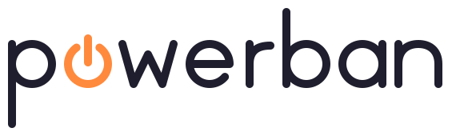

  

  
  
  
  

  <b>Kanban board for power users.</b> 
  Create multiple boards, group them, nest boards inside other boards, and more.

  <i>Project status: Planning and setup.</i>

  <a href="#features">Features</a> · <a href="#license">License</a>

---

## Features

Here are the features that will be developed, at least until the MVP.

**Functional**
- Multiple boards, organized into groups
- Nested boards: a task can be a board
- WIP limits per column
- Progress bars that roll up from child boards to parent cards
- Board and card templates

**Customization**
- Themes: Gruvbox, Catppuccin, and more

## License

This project is licensed under the [MIT License](LICENSE).
